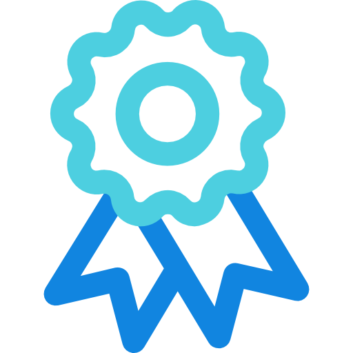

------------
<h1> Hey! Nice to see you.</h1>

Welcome to my page!   I'm Satendra, A Polyglot developer from <b>Bangalore, India</b>. I have 10+ years expireance and I have mostly worked on dotnet C#, Python,C++ AWS. 

#### :eyes: I design-develop-build-test-doc-package-deploy-monitor web,cli,library etc software applications.

  
------------
##   Certifications
[AWS Certified Solutions Architect – Professional](https://www.credly.com/badges/2bbcc05f-4045-4ee7-87d3-b8c06dfb26d8/public_url)

[AWS Certified DevOps Engineer – Professional](https://www.credly.com/badges/ea4fb840-e0c6-43a9-9565-f80ee2eefe42/public_url)

## :space_invader: Services 

<!--

    Python 
    C#  
    C++  
    Bash 

%%{init: {'theme': 'base', 'themeVariables': { 'pie1': '#9b4993', 'pie2': '#ffffff', 'pie3': '#ffde57', 'pie4': '#00549D', 'pie5': '#72a824'}}}%%

pie title Relative Self Confidence
    "C#" : 40
    "Other": 20
    "Python" : 15
    "C++" : 15
    "Bash": 10

-->
|Langugage           | Application Type  |
|--------------------|-------------------|
|C#,  C++,  py | Command Line Tool development |
|C#,  C++, py | Library development |
|C#,HCL,  yml| AWS IaaC CDK, Teraform, Cloudformation|
|Bash, py,  yml|CICD github workflow
|C#,py | Microservice development |
|C#, py| AWS Serverless App development |
|C#, py| Docker packaging |
|C#, py | Data pipeline development
|C#, py|Authentication and Access Managment implementation (LDAP) |
|Bash, py | Automation scripting bash and python |
|C# |Nuget packaging |
|C# | REST API Development 
|py | PyPI packaging |
|py | Website Scraper Scripting |
|py|Private PKI |
|TS| Reactjs
||Grafan-loki-promtail

## :telescope: Way of Design and Development

| Task                          | Description |
|-------------------------------|-------------|
| Phase1 | Proof of Concept |
|  | Collecting requirements from stakeholders |
| Phase2 | Identifying traits and interfaces |
|  | Establishing rules for development |
|  | Breaking down the project into modules |
|  | Setting up boundaries for fitness functions |
|  | Choosing dependency management tools |
| Phase3 | Writing and developing code |
|  | Defining logging strategies |
|  | Implementing application analytics |
|  | Setting up caching strategies |
|  | Writing unit tests |
|  | Performing quality scans |
|  | Creating documentation |
|  | Setting up CI/CD workflows |
|  | Implementing monitoring solutions |
|  | Planning for disaster recovery |
| Phase4 | Hand Over and move on